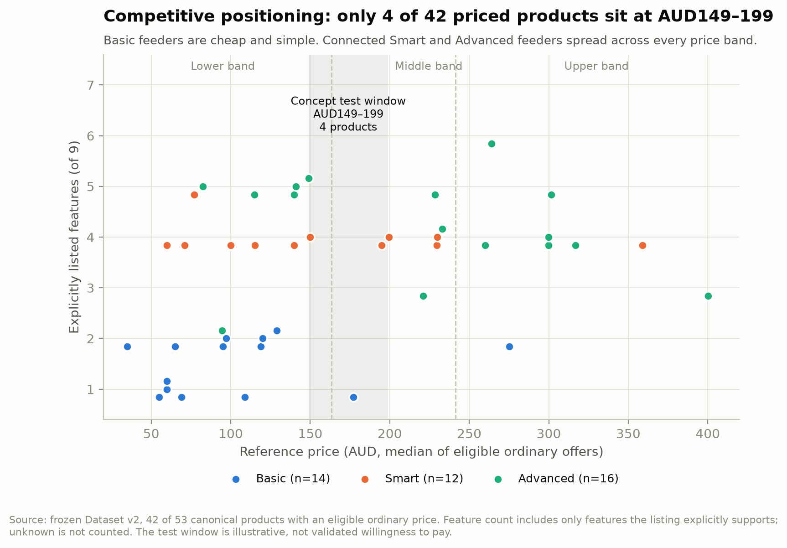
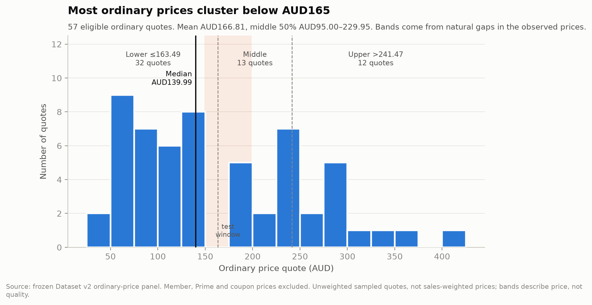
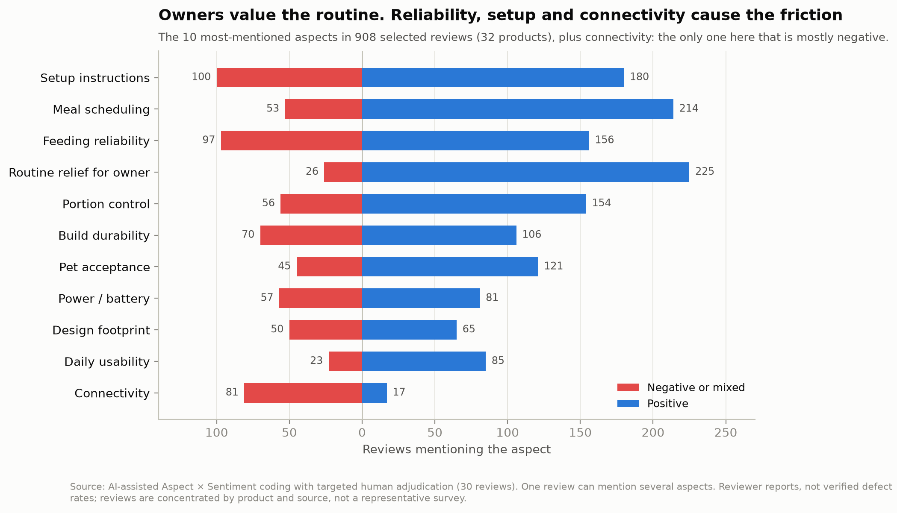
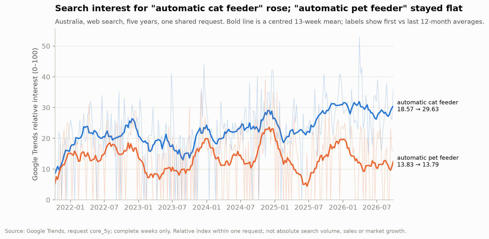

# Australia Automatic Pet Feeder: Market Analysis to Product Concept

**Status: Final (v1.0, frozen October 2026).** An independent desk-research and product-design case study.

[Live concept website](https://australia-pet-feeder.vercel.app) · [Executive summary](reports/executive_summary.md) · [Full case study](reports/case_study_en.md) · [PRD summary](product/prd_summary.md)

## The recommendation

If a new brand entered Australia's automatic pet feeder category, it should **not compete on features. It should build a cat-focused dry-food feeder that reliably runs its schedule on the device itself, with the app as an optional extra.** The proposed test price is AUD149–199.

Four findings lead there:

1. **Owners buy feeders to protect a routine, and reliability is where products let them down.** In 908 reviews across 32 products, relief from the daily feeding routine is the most praised aspect (225 positive mentions). Setup (100 negative or mixed mentions) and feeding reliability (97) are the most common complaints. Reliability complaints appear for 18 of the 32 products.
2. **Connectivity is the most negatively reviewed of the frequently discussed aspects:** 81 negative or mixed mentions against 17 positive, the most lopsided ratio among aspects with 100+ mentions. That is why the app is optional and a feeding schedule never depends on Wi-Fi or the cloud.
3. **The mid-price space is thinly populated.** Ordinary prices have a median of AUD139.99. Only 4 of 42 priced products sit between AUD149 and AUD199. Basic feeders are cheap and simple; connected feeders spread across every price band.
4. **Cat owners are the clearer audience.** Australian search interest for "automatic cat feeder" rose from 18.57 to 29.63 (first versus last 12-month average, Google Trends index), while "automatic pet feeder" stayed flat at 13.83 to 13.79.

## The evidence

| Evidence | Scope |
| --- | --- |
| Supply | 53 products, 70 retail listings, 80 seller offers across specialist, general and marketplace retailers |
| Prices | 57 eligible ordinary price quotes covering 42 products |
| Same product, different retailers | 13 confirmed cross-retailer matches |
| Consumer reviews | 908 reviews of 32 products from 16 brands, coded into 32 aspects |
| Demand | Five years of Australian Google Trends, plus national pet ownership and spending context |

The figures are reproducible from the bundled data: `pip install matplotlib`, then `python -m src.visuals.make_figures`.

## The product concept

- **Who it is for:** cat owners on a scheduled dry-food routine who cannot be home for every meal.
- **Core (works with no app or internet):** schedules and portions stored on the device, manual feeding, clear status, safe recovery after power or network interruptions, and safe refill and cleaning.
- **Optional app:** remote schedule edits, status and alerts. A change made in the app only counts as applied once the device confirms it.
- **Honest status:** the device reports that it *attempted* to dispense, and does not claim the food was delivered or eaten unless a sensor can prove it.
- **Left out of version 1:** camera, audio, microchip access, wet-food refrigeration and anything that requires the cloud.

The concept is detailed in the [product overview](product/product_overview.md), [user flows](product/user_flows.md), [status model](product/status_model.md), [key decisions](product/key_product_decisions.md) and [metrics and validation plan](product/metrics_and_validation.md). The [live website](https://australia-pet-feeder.vercel.app) includes a clickable low-fidelity prototype.

## How the research was done

- **Data collection:** public product pages from Australian retailers and Amazon Australia, collected with source URLs, timestamps and field-level provenance. A small pilot first tested which sources and fields were reliable.
- **Product identity:** products were matched across retailers by barcode (GTIN), model number or ASIN, and verified configuration, never by similar names alone. Products, listings and offers are counted separately.
- **Missing data:** a feature the page does not mention is recorded as unknown, not as absent.
- **Prices:** a price counts only with a clear product match, a current AUD price, a URL and a timestamp. Member, Prime and coupon prices are kept out of the ordinary-price analysis.
- **Reviews:** each review was coded by aspect, sentiment and severity, with a quoted excerpt as evidence. Coding was AI-assisted. 30 reviews received targeted human review (24 accepted, 6 modified, 0 rejected), and a later audit corrected 4 overstated severity ratings.
- **Search demand:** Google Trends values are only compared within the same request, because each request is scaled separately.

Details: [methodology](docs/methodology.md), [data dictionary](docs/data_dictionary.md) and [project workflow](docs/project_workflow.md).

## Limitations

This is desk research, so its conclusions are hypotheses to test, not proven results.

- **Samples are targeted, not representative.** Products were chosen to cover brands, channels and product types; reviews are concentrated in certain products and sources, and Amazon reviews are not limited to Australian buyers. Counts are not market shares.
- **Review coding** is AI-assisted with targeted human checks, not independently double-coded. Reviews are customer claims, not verified defect rates.
- **Search interest is relative.** It is not search volume, sales or market size. National pet-spending figures provide context, not a feeder market estimate.
- **The price window is a test range,** not validated willingness to pay. The suggested channels (specialist pet retail first, Amazon Australia second) have no retailer commitments or cost model behind them.
- **Nothing has been built or tested with users:** no interviews, hardware, usability testing or launch. The requirements, prototype and metrics are design proposals.
- **Prices are a single snapshot** from October 2026.

Full list: [limitations](docs/limitations.md).

## Repository guide

| Path | Contents |
| --- | --- |
| [reports/](reports/) | Executive summary and full case study |
| [product/](product/) | Product overview, PRD summary, flows, status model, decisions, metrics |
| [figures/](figures/) | The four charts above |
| [data/processed/](data/README.md) | Six cleaned summary tables (no raw review text) |
| [src/](src/README.md), [tests/](tests/) | Python modules that reproduce the published numbers (`python -m unittest discover -s tests`) |
| [docs/](docs/) | Methodology, data dictionary, workflow, limitations |
| [portfolio_website/](portfolio_website/README.md) | Source of the live website (Vite; deployed by Vercel from `main`) |
| [dashboard/](dashboard/README.md) | Tableau: presentation layer prepared; native dashboard not built |

Raw review text, collection artifacts and the full internal PRD are not published.

## Tools and AI use

Python (standard library for analysis and tests; matplotlib for figures), Google Trends, and HTML/CSS/JavaScript with Vite for the website. Tableau: presentation layer prepared; native dashboard not built. AI assisted with data engineering, review coding, code and documentation. The author set the evidence rules, reviewed the coding, interpreted the results and made every product decision.
