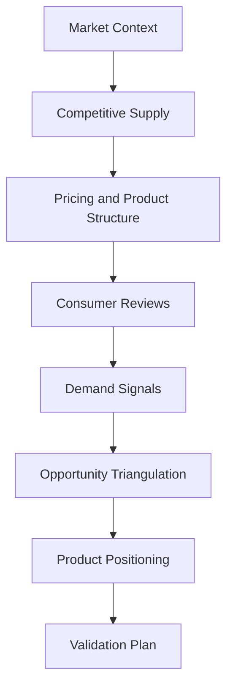

# Business Workflow

1. **Market context:** establish why the Australian pet-consumer setting is relevant, without treating pet spending as feeder market size.
2. **Competitive supply:** curate representative product jobs, brands and retail environments; preserve product/listing/offer identity.
3. **Pricing and product structure:** isolate eligible ordinary AUD prices, compare observed bands and retain unknown features.
4. **Consumer reviews:** use AI-assisted aspect/sentiment/severity coding with targeted human adjudication; consider positive value, friction, product breadth and corrected critical reports separately.
5. **Demand signals:** examine Australian relative search direction and wording within compatible requests; supplement with source-specific engagement context.
6. **Opportunity triangulation:** compare evidence and uncertainty qualitatively; no additive score or claim that most complaints equals greatest opportunity.
7. **Product positioning:** select the reliability-first cat routine hybrid for validation, with restrained optional connectivity and conditional price/channel hypotheses.
8. **Validation plan:** test preference, performance, usability, truthful status, costs and channels before deciding whether to launch.

The modules reproduce public aggregates and reporting rules. Private source acquisition and semantic review coding are not regenerated by this release. Tableau data preparation/design is complete; native dashboard build and validation are pending.
