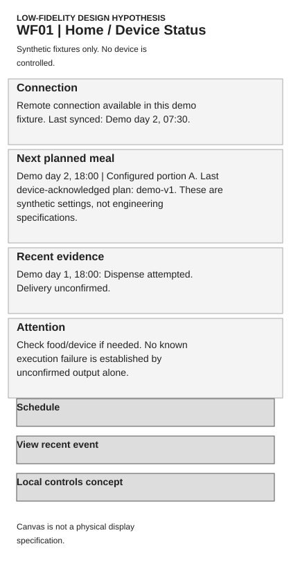
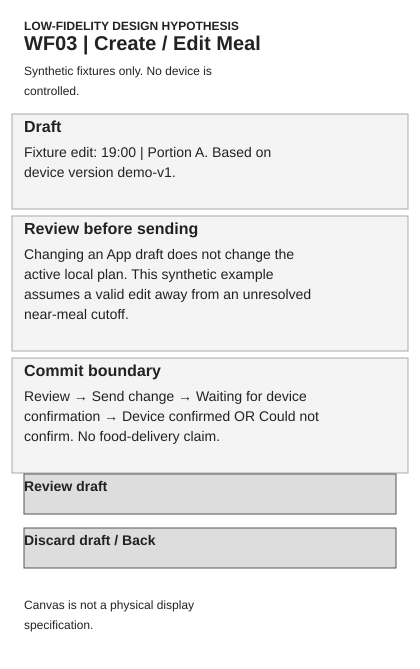
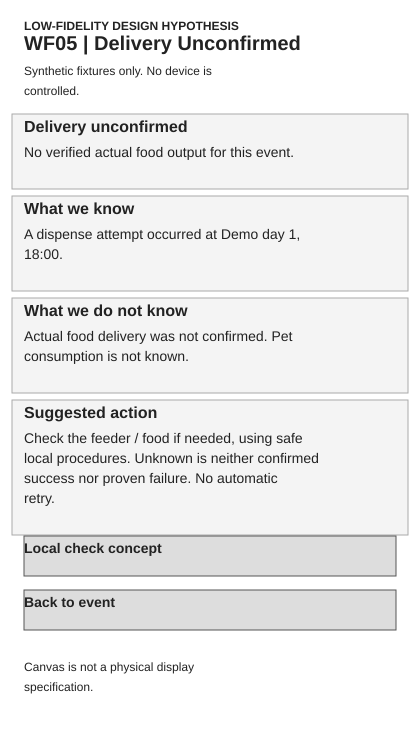
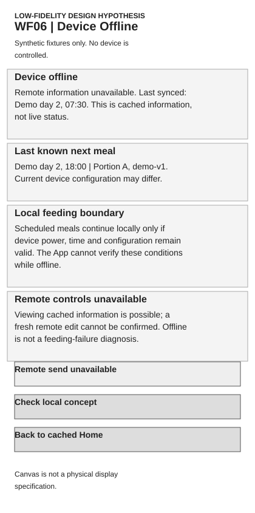
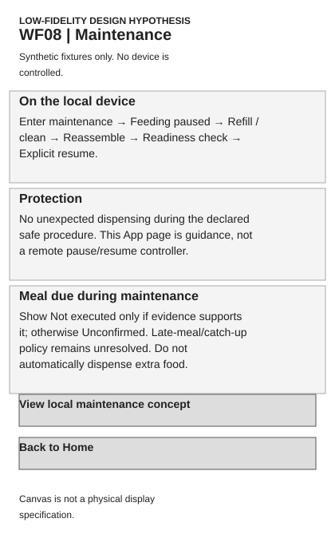

# Australia Automatic Pet Feeder: From Market Opportunity to MVP Product Design

## Executive summary

What should a hypothetical new pet-care brand offer in Australia, for whom, and how should that concept be validated? I used a frozen retail dataset, consumer reviews and relative search signals to develop a product direction rather than a launch claim. The research covered 53 canonical products, 70 listings, 80 offers, 57 eligible ordinary price observations and 908 reviews across 32 reviewed products and 16 brands.

The selected user is the Routine-focused Cat Owner: someone who cannot supervise every planned dry-food meal and needs dependable scheduling with understandable status. The primary concept combines reliability-first execution with simple cat-oriented routines and lightweight optional connectivity. Its MVP keeps schedule authority and core controls local; the App adds convenience without becoming a feeding prerequisite.

The key design decision is to distinguish an execution attempt from confirmed food delivery. Uncertain output remains “Delivery unconfirmed,” while remote edits remain pending until the device acknowledges its committed version. A low-fidelity prototype demonstrates these boundaries. Measurement combines activation, routine continuity, execution evidence and safety guardrails rather than claiming a feeding-success rate.

The result is a scoped MVP, PRD, interaction prototype and validation plan. Hardware feasibility, usability, willingness to pay and channel economics remain untested. The concept is recommended for validation, not launch.

## 01 Context & Business Question

This is a self-directed portfolio project for a hypothetical new pet-care brand, not a real client engagement. The market is Australia and the category is automatic pet feeders. The business question is what a new entrant should offer, to which user, with which essential capabilities, at what competitive position, and with what proof before proceeding.

I treated product selection and product validation as separate decisions. Public market evidence could help narrow a direction, but could not establish that an engineered device would work or that households would purchase it. The project therefore ends with a coherent product hypothesis and a plan to test it. It does not present an actual product launch, product-market fit or a sales forecast.

## 02 Research & Evidence

The supply layer contains 53 canonical products, 70 retail listings and 80 seller offers. Canonical identity avoids counting a product repeatedly when it appears across retailers. Price analysis uses 57 eligible ordinary price observations; member, Prime and other special offers remain separate. The sample is targeted, not an exhaustive Australian assortment or a source of market-share estimates.

The consumer layer contains 908 analysis-ready reviews covering 32 products and 16 brands. Australian retail-context reviews and Amazon-platform reviews retain different geography limits. The corpus is a convenience sample with product and source concentration; Australian retail context does not establish reviewer residence. Review claims describe experiences, not independently verified defects. Corrected severity results inform the case.

Five-year Google Trends signals add relative search direction and wording. Only compatible normalization groups are compared. Cat-oriented search expressions strengthened within the tested comparisons, but this is not category sales growth or a purchase-share estimate.

Four observations informed the design: scheduling and routine relief have clear reported value; reliability and setup recur as friction; connectivity provides convenience alongside configuration and failure burden; cat-oriented search language supports a focused use context. These observations are not evidence that every Australian household wants the same product. They identify questions worth testing, while successful incumbent experiences remain visible.

## 03 Opportunity Identification

I retained four concepts before narrowing the primary direction: a reliability-first connected routine feeder, a simple cat-oriented routine feeder, a selective-access product for individual diets, and a freshness-oriented timed wet-food product. Each addresses a different combination of job, mechanism and proof obligation.

The selected primary combines the first two, OH1+OH2: a reliability-first, cat-oriented dry-food automatic feeder with lightweight optional connectivity. Supply establishes existing competing configurations; reviews establish valued routines and operational friction; search adds scoped support for automatic and cat-oriented language. The choice follows qualitative Supply × Consumer × Demand triangulation, not an arbitrary numerical opportunity score.

OH3 remains a secondary niche requiring separate access-control, compatibility and training validation. OH4 remains deferred because wet-food compatibility and preservation need additional proof. Neither is declared unattractive. The primary direction also does not establish a competitive whitespace: incumbents may already execute similar capabilities well. Differentiation must be demonstrated through performance and usability rather than inferred from missing public specifications.

## 04 Target User & JTBD

The sole primary persona is the Routine-focused Cat Owner. It is an evidence-derived use-context hypothesis, not a statistically validated segment or a fictional biography. I assigned no age, income, occupation, name or stock photograph.

The context is scheduled dry-food feeding when an owner cannot supervise every meal. The core job is to establish an appropriate intended routine and know what the device actually did. Relevant pain points include uncertain execution, burdensome setup, connectivity interruptions and cleaning or recovery tasks. Needs include understandable local controls, persistent schedules, supported portion settings and truthful state information. These are design hypotheses derived from the selected evidence, not independently interviewed preferences.

The frozen JTBD is: “When I cannot supervise each planned dry-food meal, I want my cat to receive the intended portion on schedule with clear local control and status, so that feeding fits my routine without depending on an always-working app or network.”

The cat focus makes concept recruitment and intended-use testing more specific. It does not imply that dogs lack demand, or that the target population has been sized.

## 05 Product Definition & MVP

Four principles constrain the concept: feeding first; local execution before cloud dependency; evidence before reassurance; and design for interruption and recovery. Together they prioritise the routine over an expanding feature catalogue.

MVP Core includes local schedule storage, supported portion configuration, scheduled dispensing, local editing and control, truthful status, network-independent configured execution, recovery, and safe refill/cleaning. Network-independent execution remains conditional on valid device power, time and configuration. It is not a promise to continue through every outage.

Connected Support includes optional App onboarding, remote schedule editing, remote status and basic alerts. Those capabilities support convenience; local setup and meals must remain accessible without account or pairing. Battery backup is a supporting experiment outside the baseline, not an assumed source of continuous operation.

Camera, audio, RFID/microchip selective access, wet-food preservation and smart-home dependency are not v1. Actual-delivery sensing and richer history remain conditional or deferred. Their exclusion is a scope decision, not a claim that consumers dislike them. The MVP tests whether the selected job can be performed clearly and reliably before adding additional jobs and engineering burden.

## 06 Key Product Decisions

### Decision 1: Local-first execution

**Problem:** A planned meal should not require an available remote service. **Evidence:** Routine value, reliability concerns and the selected JTBD establish the design context; direct offline-specific review evidence is narrow. **Decision:** The locally committed schedule is execution authority. **Trade-off:** Persistent firmware, controls and recovery increase implementation burden. **Validation needed:** Network and authentication interruption tests, plus user understanding of conditional continuity. Local-first improving trust remains a hypothesis, not an observed result.

### Decision 2: Optional connectivity

**Problem:** Remote convenience can introduce pairing, service and status uncertainty. **Evidence:** Reviews include both positive connected experiences and connectivity friction. **Decision:** Keep a minimal connected support path without making it a prerequisite. **Trade-off:** Maintain two understandable interaction surfaces and secure version reconciliation. **Validation needed:** Compare local-only and connected tasks, evaluate whether optional value justifies cost, and test late acknowledgements and conflicts. A weak connected experience would justify deferral, not a new dependency on the App.

### Decision 3: Evidence-based status

**Problem:** Motor activity can be mistaken for a completed meal. **Evidence:** The product truthfulness model distinguishes command, attempt, output and consumption. **Decision:** Show “Delivery unconfirmed” when actual output is not established. **Trade-off:** Honest uncertainty is harder to communicate than a reassuring checkmark. **Validation needed:** Comprehension tasks and independent output measurement. Confirmed delivery would require validated sensing; no interface state can prove ingestion from an actuation record.

### Decision 4: Exclude camera and audio

**Problem:** Feature parity can expand scope beyond the selected feeding job. **Evidence:** The frozen concept prioritises scheduled dry-food routines; no camera-dislike claim is supported. **Decision:** Exclude camera and audio from v1. **Trade-off:** Less monitoring appeal and fewer feature-comparison talking points, in exchange for a narrower design and proof burden. **Validation needed:** Test whether the intended user accepts that trade-off and whether excluded monitoring is essential to their actual job. No cost saving is claimed without engineering estimates.

### Decision 5: Recovery belongs in MVP

**Problem:** Restart, power loss and maintenance can leave uncertain or repeated execution. **Evidence:** The job includes maintaining a routine, while the frozen requirements cover interruption and safe restoration. **Decision:** Include occurrence-aware recovery and maintenance boundaries in core design. **Trade-off:** More states and testing than a happy-path schedule editor. **Validation needed:** Interrupt execution and persistence at different stages, inspect output independently, and test safe pause/resume. Near-meal override and catch-up policies remain open rather than silently selected.

## 07 PRD & Critical Requirements

The PRD contains 38 requirements and 42 acceptance criteria. This scale describes authored design artefacts, not implementation progress. Seven representative requirements show how the decision becomes testable: local schedule storage requires durable commit and readback; scheduled dispense requires intended occurrences under a declared food/time envelope; local editing separates drafts from active settings; offline continuity removes the remote dependency; status truthfulness limits claims to available evidence; restart recovery preserves uncertain occurrence handling; and safe maintenance prevents unexpected operation under an approved procedure.

Acceptance criteria express future tests, not passing results. Food compatibility, portion tolerance, timing limits, repetitions, sensing architecture and exact local controls need engineering approval. A requirement cannot be accepted simply because the prototype renders its intended state. This separation keeps product intent useful while leaving implementation choices and physical proof open.

## 08 User Flow & Edge Cases

The first critical sequence is: scheduled meal → dispense attempt → actual delivery cannot be verified → Delivery unconfirmed → safe feeder inspection. There is no automatic repeat. Unknown output is neither confirmed success nor established failure; another dispense could create unintended extra food. The interface explains what is known, what is unknown and what the user can check.

The second sequence is: App draft → reviewed request sent → waiting for device confirmation → matching device acknowledgement → confirmed committed version. An App-side save is not a device-side commit. Without acknowledgement the view remains unconfirmed; the device may already have applied the request, so blind resend is inappropriate. Version and request identity matter more than a transport success animation.

Offline views show last sync and cached information. They explain that local meals can continue only with valid power, time and configuration, which the App cannot verify remotely. Maintenance pauses feeding under a safe local procedure, supports refill/cleaning and reassembly, and requires explicit resume. Due-meal policy remains unresolved and no automatic catch-up is invented.

## 09 Prototype

The low-fidelity prototype is grayscale, with simple components and synthetic demonstration fixtures. It is not final UI, a functioning hardware product or a usability-tested design. The selected views are Home/Device Status, Schedule/Edit, Delivery Unconfirmed, Device Offline and Maintenance. A simplified local-interface concept demonstrates that core interaction does not require the App; it does not select an industrial display or button arrangement.

Three paths demonstrate normal editing with device confirmation, offline/cached information with local continuation boundaries, and feeding uncertainty with safe inspection. External fixture controls simulate acknowledgements and connectivity; they are not product buttons or observed device events. This prototype communicates decision logic. It does not validate timing, reliability, physical output or user comprehension.

Selected low-fidelity states (design hypotheses, not test results):

## 10 Metrics & Validation

The primary outcome is that users establish and maintain a scheduled dry-food routine with understandable execution status and without core connectivity dependence. I measure component progress rather than force a single North Star that the evidence cannot support.

Activation uses setup completion and first schedule creation. Routine measurement uses scheduled attempt evidence and observed local continuity. Reliability uses supported non-execution, unconfirmed outcomes, recovery failures and duplicate execution incidents. Connected convenience uses device-confirmed remote edits and sync recovery. Unsupported success-message incidents are a guardrail. Numerators, eligible denominators, missing evidence and matured observation windows remain explicit. App return is optional and cannot stand in for routine retention.

Dispense attempt is not equivalent to food delivery or pet consumption. Missing offline records cannot become either success or failure. Local operational evidence, App interactions and cloud transport data have separate meanings; synchronizing a record cannot authorize a new meal or prove its outcome.

Validation is planned in four main layers: concept relevance, prototype usability, hardware reliability and offline/recovery testing. Price and channel validation supplement them. The Lower-to-Middle context and illustrative AUD149–199 window are testing inputs, not a launch price or validated willingness to pay. A specialist retail pilot and controlled Amazon AU listing remain channel hypotheses without commitment, conversion or profitability evidence. No test has been executed.

## 11 Limitations & Next Steps

The project relies on secondary research and targeted convenience samples. It offers no representative Australian consumer segmentation, validated WTP, real product telemetry, hardware prototype, usability result, PMF claim or launch approval. Source geography, syndication, product mix and feature unknowns limit inference. AI assisted research engineering, classification support, documentation, QA and product-design structuring; human framing, evidence rules, targeted adjudication and decision ownership remain explicit. Authored outputs are not independent validation.

The next five tests are: whether users understand Delivery unconfirmed; whether local-first improves perceived trust; whether first setup can be completed without assistance; whether power/network interruption recovery is safe; and whether the concept is feasible within realistic hardware and cost constraints. Results may require revision or abandonment. They are not assumed to confirm the direction.

I started from market and consumer evidence, identified a product opportunity, translated it into a defined user problem, designed an MVP and PRD, worked through failure/recovery interactions, built a low-fidelity prototype, and defined how the product would be measured and validated.

### Selected artefacts and evidence

Market and consumer synthesis · Conditional recommendation · Persona and definition · MVP decision log · PRD · Flows · [Low-fidelity prototype](../prototype/index.html) · Metrics framework

This public presentation preserves the original research and validation boundaries.
